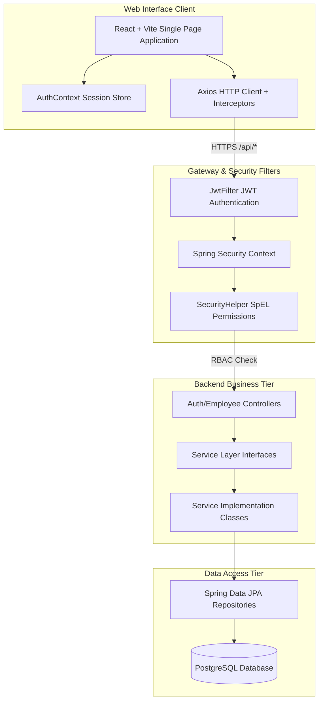

# System Architecture Specification

This document details the software architecture, runtime execution flows, security design patterns, and components of the **NexusHR** enterprise application.

---

## 🏛️ High-Level System Architecture Diagram



---

## 1. Backend Multi-Tier Software Patterns

The Spring Boot backend is structured as a decoupled, multi-tier service complying with standard Java Enterprise MVC principles:

1.  **Presentation/Web Layer (Controllers):** Handles incoming REST requests, maps inputs (DTOs), and returns JSON response payloads. This layer is annotated with `@RestController` and secured using class/method-level `@PreAuthorize` rules.
2.  **Security Layer (JWT Filters):** Intercepts requests to validate signature integrity, parse user authority scopes, and populate the thread-local security context.
3.  **Business Logic Layer (Services):** Interfaces and implementations (`*ServiceImpl.java`) coordinating transactions, validating state invariants (e.g., checking leave pool balances before approval), and conducting data mapping.
4.  **Data Access Layer (Repositories):** Layer mapping Java entities directly to SQL tables via Hibernate and Spring Data JPA.

---

## 2. Spring Security & Access Control Flow

NexusHR implements a state-free, token-based security architecture designed to prevent cross-tenant data leakage:

```text
[HTTP Client Request]
       │
       ▼
┌──────────────┐
│  JwtFilter   │ ──(Token Invalid)──> [401 Unauthorized]
└──────────────┘
       │ (Valid Token)
       ▼
┌─────────────────────────────┐
│  SecurityContextHolder      │ ──> Populates Principal with UserDetails
└─────────────────────────────┘
       │
       ▼
┌─────────────────────────────┐
│  Controller Method          │ ──> Checked by @PreAuthorize
└─────────────────────────────┘
       │
       ▼
┌─────────────────────────────┐
│  SecurityHelper (SpEL Check)│ ──(Owner Check Fails)──> [403 Forbidden]
└─────────────────────────────┘
       │ (Access Granted)
       ▼
[Execute Business Logic]
```

### Access Control Mechanism (RBAC):
*   **Token Verification (`JwtFilter.java`):** Parses the `Authorization: Bearer <token>` HTTP header, decrypts the token signature using the secret key, and extracts the username (email) and role scope.
*   **Security Context Registration:** Sets the current active execution principal inside Spring Security's `SecurityContextHolder`.
*   **Method-level SpEL Guard (`SecurityHelper.java`):**
    *   Methods annotated with `@PreAuthorize("@securityHelper.isOwner(#employeeId)")` invoke a custom class that checks if the username claims in the active JWT match the targeted employee ID's email.
    *   Role constraints like `@PreAuthorize("hasAnyRole('ADMIN', 'HR')")` restrict general admin endpoints to authorized managers.

---

## 3. Frontend Client Architecture

The React Single Page Application (SPA) is built around a centralized authentication context and a global HTTP communication layout:

### 1. Centralized Session Context (`AuthContext.jsx`):
*   Acts as the single source of truth for the active session state.
*   Restores logged-in user profiles from secure browser storage (`localStorage`) on boot.
*   Exposes global utility flags: `isHR()`, `isAdmin()`, and the normalized employee ID mapping (`user.employee.id`).

### 2. HTTP Request Pipeline (`axiosInstance.js`):
*   **Request Interceptor:** Automatically queries `localStorage` for `nexushr_token` and injects the authorization Bearer header into every request.
*   **Response Interceptor:** Listens for backend `401 Unauthorized` responses. If a session token expires, the interceptor immediately clears user storage and redirects the browser back to the login screen.

### 3. Navigation Guarding:
*   Frontend routes inside `App.jsx` are wrapped in a high-order component (`ProtectedRoute`) to check user roles, preventing normal employees from accessing settings or admin modules.