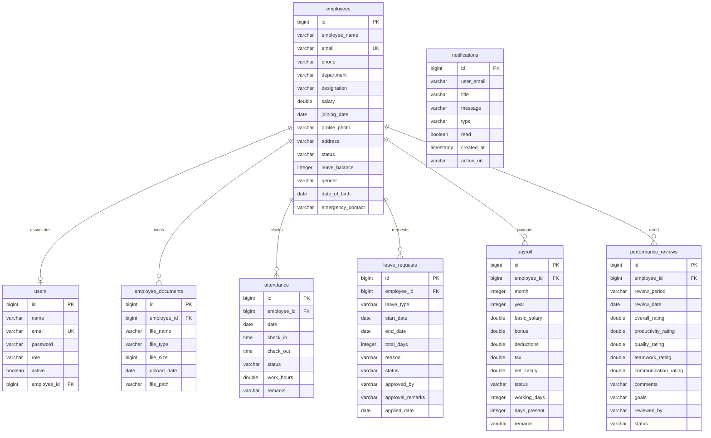

# Database Schema Design

NexusHR uses a **PostgreSQL** relational database. Entity relationship migrations are dynamically synchronized at startup via Spring JPA and Hibernate.

---

## 📊 Entity Relationship Diagram

---

## 🗂️ Detailed Database Table Specifications

### 1. `users` Table
*   Stores authentication credentials and account state.
*   *Columns:*
    *   `id` (bigint, PK): Auto-incrementing identifier.
    *   `name` (varchar, Not Null): Full name of the user.
    *   `email` (varchar, Unique, Not Null): Username used for login.
    *   `password` (varchar, Not Null): BCrypt-encrypted password hash.
    *   `role` (varchar, Not Null): Access control role (`ADMIN`, `HR`, `EMPLOYEE`).
    *   `active` (boolean, Not Null): Account status flag.
    *   `employee_id` (bigint, FK, Nullable): References corresponding employee record in `employees`.

### 2. `employees` Table
*   Stores employee profile records.
*   *Columns:*
    *   `id` (bigint, PK): Auto-incrementing identifier.
    *   `employee_name` (varchar, Not Null): Display name.
    *   `email` (varchar, Unique, Not Null): Work email.
    *   `phone` (varchar, Nullable): Contact phone number.
    *   `department` (varchar, Not Null): e.g. "Engineering", "Design", "Finance".
    *   `designation` (varchar, Not Null): Job title (e.g. "Senior Engineer").
    *   `salary` (double, Not Null): Monthly base pay.
    *   `joining_date` (date, Nullable): Date of employment start.
    *   `profile_photo` (varchar, Nullable): URI or path to profile photo.
    *   `address` (varchar, Nullable): Residential address.
    *   `status` (varchar, Not Null): Employee operational state (`ACTIVE`, `SUSPENDED`, `OFFBOARDED`).
    *   `leave_balance` (integer, Not Null, Default 15): Remaining leave balance pool.
    *   `gender` (varchar, Nullable): Gender identity description.
    *   `date_of_birth` (date, Nullable): Birthdate.
    *   `emergency_contact` (varchar, Nullable): Name and phone of contact.

### 3. `employee_documents` Table
*   Tracks file attachments associated with employee onboarding/records.
*   *Columns:*
    *   `id` (bigint, PK): Auto-incrementing identifier.
    *   `employee_id` (bigint, FK, Not Null): References corresponding employee in `employees`.
    *   `file_name` (varchar, Not Null): Original name of upload.
    *   `file_type` (varchar, Not Null): MIME file type.
    *   `file_size` (bigint, Not Null): File size in bytes.
    *   `upload_date` (date, Not Null): Date upload occurred.
    *   `file_path` (varchar, Not Null): Local disk storage location path.

### 4. `attendance` Table
*   Logs biometric timestamps and daily check-ins.
*   *Columns:*
    *   `id` (bigint, PK): Auto-incrementing identifier.
    *   `employee_id` (bigint, FK, Not Null): References employee.
    *   `date` (date, Not Null): Day of log.
    *   `check_in` (time, Nullable): Time check-in occurred.
    *   `check_out` (time, Nullable): Time check-out occurred.
    *   `status` (varchar, Not Null): Status state (`PRESENT`, `LATE`, `HALF_DAY`, `ON_LEAVE`, `ABSENT`).
    *   `work_hours` (double, Not Null): Calculated hours.
    *   `remarks` (varchar, Nullable): Daily comments.

### 5. `leave_requests` Table
*   Tracks leave requests and workflow approvals.
*   *Columns:*
    *   `id` (bigint, PK): Auto-incrementing identifier.
    *   `employee_id` (bigint, FK, Not Null): References applicant employee.
    *   `leave_type` (varchar, Not Null): Category (`ANNUAL`, `SICK`, `CASUAL`, `MATERNITY`, `UNPAID`).
    *   `start_date` (date, Not Null): Start day.
    *   `end_date` (date, Not Null): End day.
    *   `total_days` (integer, Not Null): Calculated duration of request.
    *   `reason` (varchar, Nullable): Motivation note.
    *   `status` (varchar, Not Null): State (`PENDING`, `APPROVED`, `REJECTED`, `CANCELLED`).
    *   `approved_by` (varchar, Nullable): Approving manager.
    *   `approval_remarks` (varchar, Nullable): Manager notes.
    *   `applied_date` (date, Not Null): Request date.

### 6. `payroll` Table
*   Monthly pay slips.
*   *Columns:*
    *   `id` (bigint, PK): Auto-incrementing identifier.
    *   `employee_id` (bigint, FK, Not Null): Recipient employee.
    *   `month` (integer, Not Null): Month of period.
    *   `year` (integer, Not Null): Year of period.
    *   `basic_salary` (double, Not Null): Base pay rate.
    *   `bonus` (double, Not Null): Added incentives.
    *   `deductions` (double, Not Null): Direct subtractions.
    *   `tax` (double, Not Null): Dynamic tier calculated tax (12%, 18%, 25%).
    *   `net_salary` (double, Not Null): Final pay rate (Basic + Bonus - Deductions - Tax).
    *   `status` (varchar, Not Null): Pay status (`PENDING`, `PAID`, `VOIDED`).
    *   `working_days` (integer, Not Null): Days in period.
    *   `days_present` (integer, Not Null): Days active.
    *   `remarks` (varchar, Nullable): Notes.

### 7. `notifications` Table
*   Holds message dispatch triggers.
*   *Columns:*
    *   `id` (bigint, PK): Auto-incrementing identifier.
    *   `user_email` (varchar, Not Null): Recipient user.
    *   `title` (varchar, Not Null): Title header.
    *   `message` (text, Not Null): Message text content.
    *   `type` (varchar, Not Null): Event type (`SYSTEM`, `EMPLOYEE`, `LEAVE`, `PAYROLL`, `PERFORMANCE`, `RECRUITMENT`).
    *   `read` (boolean, Not Null): Is read status flag.
    *   `created_at` (timestamp, Not Null): Created date/time.
    *   `action_url` (varchar, Nullable): Click action redirection URI path.
